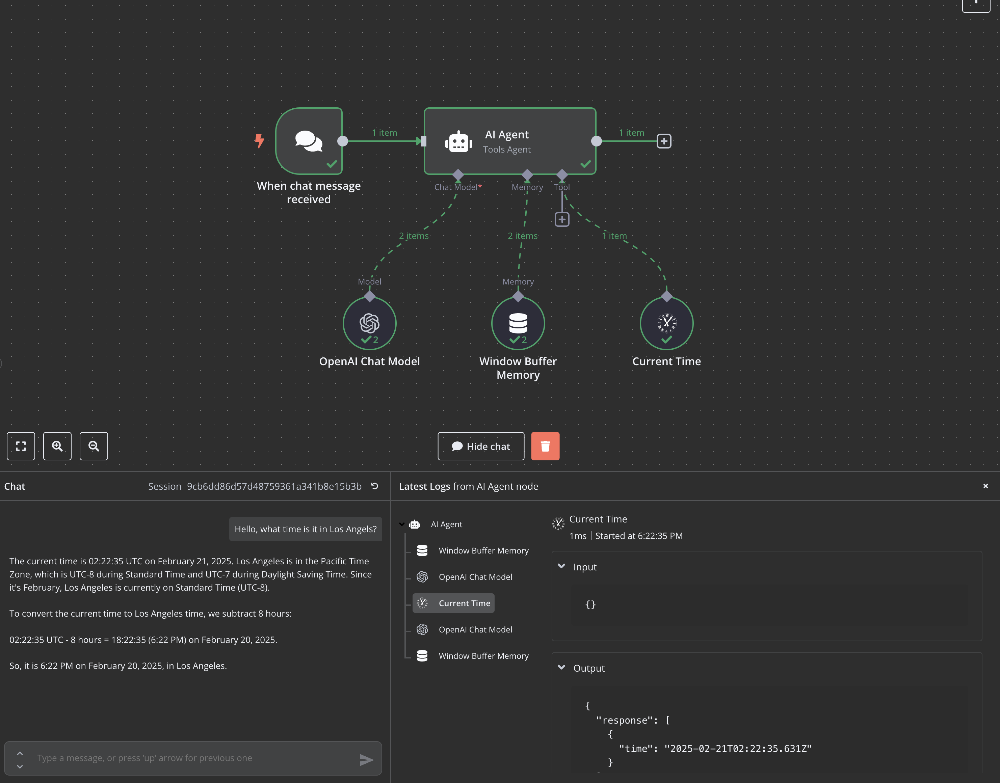

# n8n-nodes-currentTime

This is an n8n community node, which can be used as an AI Agent tool. All it does is return the current time.

I built it while trying to figure out why my other custom node wasn't working as an AI tool. After a bit of digging I learned that at the time of writing this, n8n didn't support custom nodes as AI tools.

But thankfully, right about the same time, n8n released support for custom nodes as AI tools and you could enable it via an environment variable:

https://github.com/n8n-io/n8n/releases/tag/n8n%401.79.0
https://github.com/n8n-io/n8n/pull/13075

Until this feature is enabled by default, you can enable it by setting the environment variable `N8N_ALLOW_CUSTOM_TRIGGER_NODES_AS_AITOOLS` to `true`.

```bash
$ cd /path/to/n8n
$ pnpm install
$ pnpm build
$ export N8N_COMMUNITY_PACKAGES_ALLOW_TOOL_USAGE=true && pnpm start
```	




[n8n](https://n8n.io/) is a [fair-code licensed](https://docs.n8n.io/reference/license/) workflow automation platform.

[Installation](#installation)  
[Operations](#operations)  
[Credentials](#credentials)  
[Compatibility](#compatibility)  
[Usage](#usage) 
[Resources](#resources)  
[Version history](#version-history)

## Installation

Follow the [installation guide](https://docs.n8n.io/integrations/community-nodes/installation/) in the n8n community nodes documentation.

## Operations

Only one operation - return the current date/time.

## Compatibility

This node is compatible with n8n 1.79.0 and above.

## Usage

By the time users are looking for community nodes, they probably already know n8n basics. But if you expect new users, you can link to the [Try it out](https://docs.n8n.io/try-it-out/) documentation to help them get started.

## Resources

* [n8n community nodes documentation](https://docs.n8n.io/integrations/community-nodes/)
* [Mapbox Static Images API](https://docs.mapbox.com/api/maps/static-images)
* [Mapbox Geocoding API](https://docs.mapbox.com/api/search/geocode/)
* [Mapbox Access Tokens](https://docs.mapbox.com/api/accounts/tokens/)
* [Mapbox Playground](https://docs.mapbox.com/playground/static/)

## Version history

Initial release.


